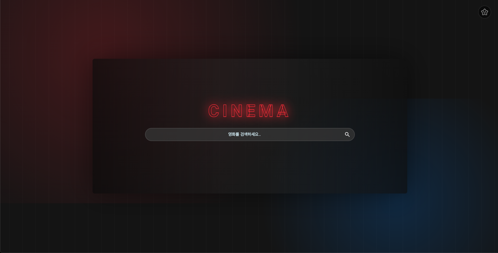
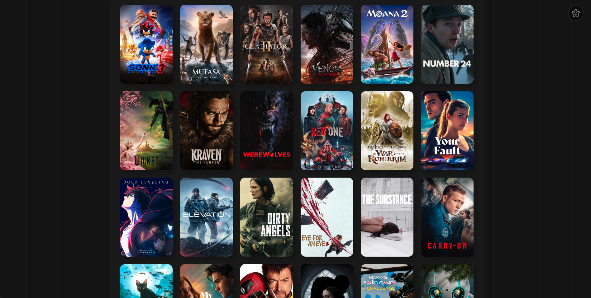
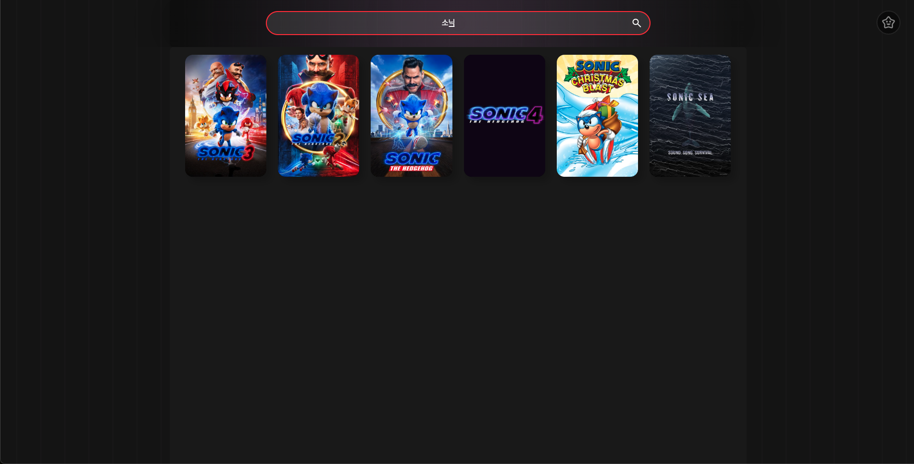
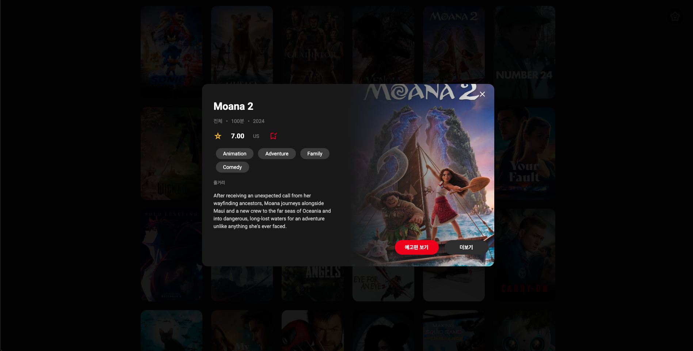

# 🎬 vanilla-js-movies



TMDB API를 활용한 영화 검색 및 북마크 기능을 제공하는 바닐라 자바스크립트 프로젝트입니다.

## 주요 기능

- 💫 무한 스크롤 기능의 영화 목록
  
- 🔍 실시간 영화 검색 (쓰로틀링 적용)
  
- ⭐ 영화 북마크 기능
  
- 🎯 영화 상세 정보 모달
  

## 기술 스택

- HTML5
- CSS3
- JavaScript (Vanilla)
- TMDB API

## 프로젝트 구조

```
/src
├── /components      # 컴포넌트 파일들
├── /constants      # 설정 파일
├── /css           # 스타일 파일
├── /services      # API 통신
├── /utils         # 유틸리티 함수
└── app.js         # 메인 로직
```

## 설치 및 실행

1. 저장소 클론

```bash
git clone https://github.com/your-username/vanilla-js-movies.git
```

2. TMDB API 키 설정

```json
// config.json
{
  "apiKey": "your-tmdb-api-key"
}
```

3. 실행

```bash
# VS Code Live Server 등으로 실행
```

## 스크린샷

| 메인 화면                                 | 상세 정보                                  |
| ----------------------------------------- | ------------------------------------------ |
|  |  |

## 향후 계획

- [ ] 다크 모드
- [ ] 카테고리별 필터링
- [ ] 반응형 디자인 개선

---

Made with ❤️ by [sum529-create]
